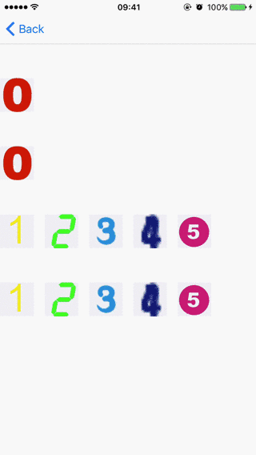
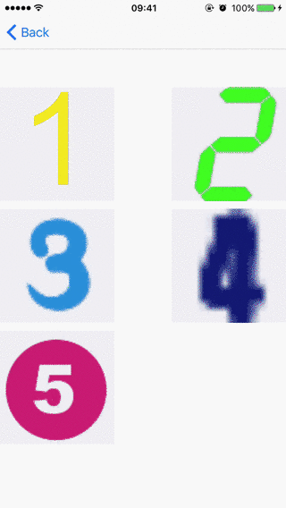

# SWImageViewerController

A controller to view images.

## Major features

### Single image


### Tap to hide or show navigation bar



### Mutiple images


### Delete image



## How to use

### For single image

#### Initialize
```
let viewer = SWImageViewerController(image: imageToShow)
```

#### Set original image view frame for zooming animations
```
// There are zooming animations when image appears and disappears by default
viewer.imageViewOriginalFrame = imaageViewFrame
```

#### Or stop zooming animation
```
viewer.zoomsImageViewWhenViewDidLoad = false
viewer.zoomsImageViewWhenGoingBack = false
```

#### Present to show
```
present(viewer, animated: true, completion: nil)
```

#### Or push to show
```
let nc = UINavigationController(rootViewController: viewer)
nc.modalPresentationStyle = .overCurrentContext
present(nc, animated: true, completion: nil)
```

### For multiple images

#### Initialize
```
let viewerPageVC = SWImageViewerPageVC(images: imagesArray)
viewerPageVC.indexOfFirstImageToShow = index // index < imagesArrayToShow.count
```

#### Set original image view frames for zooming animations
```
// No zooming animation when imageViewOriginalFrames is nil
viewerPageVC.imageViewOriginalFrames = originalFramesArray // Use imageViewOriginalFramesObjc for Objective-C
```

#### Present to show
```
present(viewerPageVC, animated: true, completion: nil)
```

#### Or push to show
```
let nc = UINavigationController(rootViewController: viewerPageVC)
nc.modalPresentationStyle = .overCurrentContext
present(nc, animated: true, completion: nil)
```

#### Show delete button on navigation bar
```
viewerPageVC.showDeleteButton = true
viewerPageVC.viewerDelegate = self

// Implement SWImageViewerPageVCDelegate

func imageViewerPageVC(_ pageVC: SWImageViewerPageVC, deleteButtonClicked button: UIButton, atPage page: Int) {
	imagesArray.remove(at: page - 1) // page starts from 1
}
```